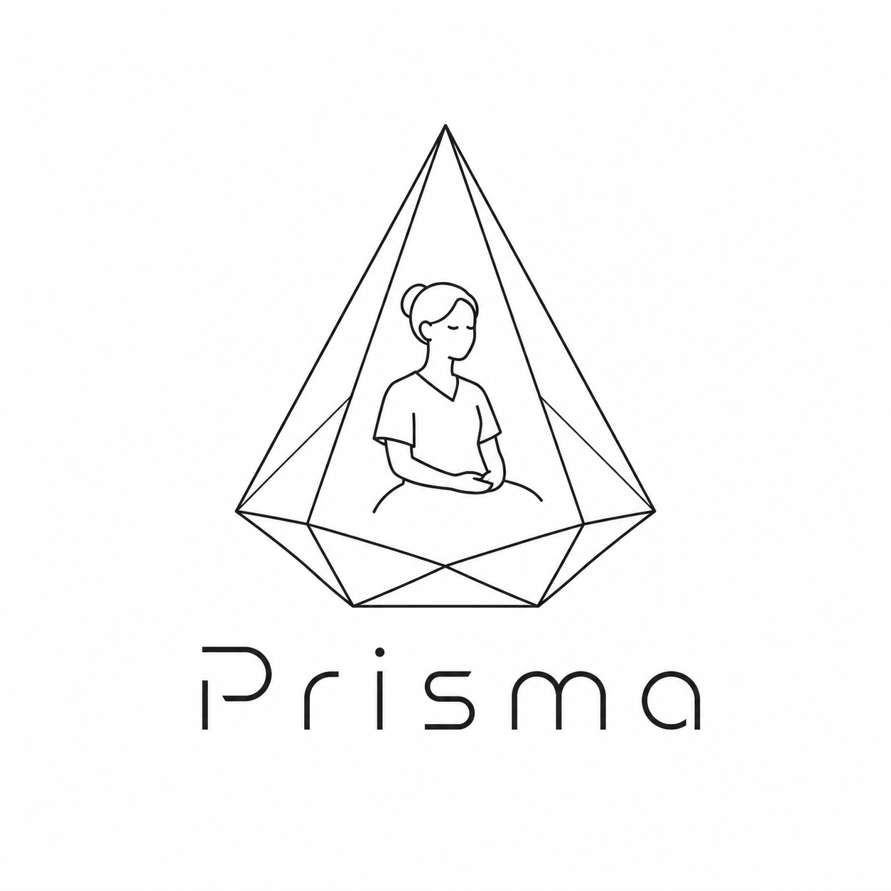
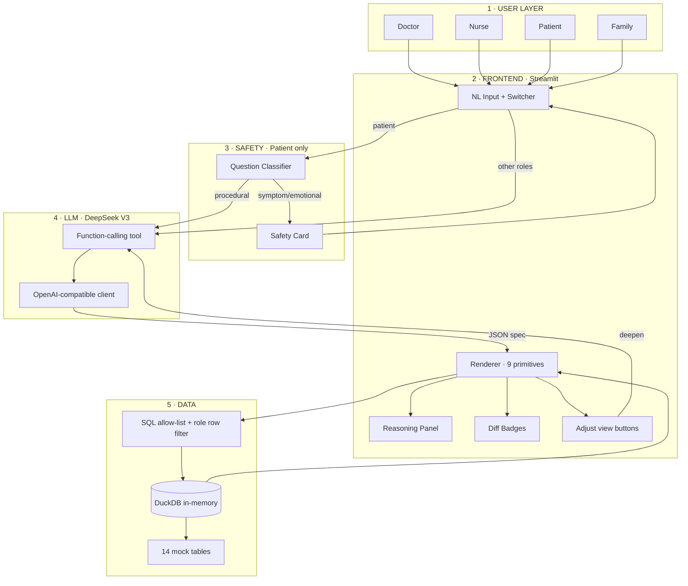

<div align="center">



# Prisma

**One truth. Four views. Made for this person, right now.**

A multi-stakeholder generative dashboard for hospital post-op care.
One underlying patient state is *refracted* into four role-specific UIs
(doctor / nurse / patient / family) — each with different content,
different language, and different boundaries.

[**📄 Deck (PDF)**](docs/prisma-deck.pdf)  ·  [**→ Deck (GitHub-readable)**](docs/slides.md)  ·  [**→ Architecture**](docs/ARCHITECTURE.md)  ·  [**→ Slidev source**](docs/slides.slidev.md)

</div>

---

## Three patterns this project is claiming as new

| Pattern | What it means |
|---|---|
| **Refraction** | One truth → many UIs. The agent is a *prism*, not a renderer. It splits one patient state into role-specific views in real time. |
| **Cognitive recasting** | Same fact → different language. Doctors see numbers; patients see plain words; family sees reassurance. Not permission filtering — semantic translation. |
| **Graceful refusal** | "No" as a visible action. When the agent shouldn't act, refusal becomes a UI element (a fixed safety card with a "call nurse" button), not a hidden rule in a system prompt. |

> Today's generative UI (Cursor, v0, Canvas) is *one user × one intent × one UI*.
> Prisma is *one truth × many stakeholders × many UIs.*

---

## Quick start (≈ 3 min)

```bash
python -m venv .venv && source .venv/bin/activate
pip install -r requirements.txt

cp .env.example .env
# Fill in DEEPSEEK_API_KEY (DeepSeek V3, OpenAI-compatible)

python seed.py                          # generate 14 mock CSVs into ./data
python cache_specs.py rebuild           # optional: pre-bake fallback specs
streamlit run app.py
```

Open http://localhost:8501 — sidebar lets you switch role × patient × actor.
Type a question, click a chip, or click an *Adjust view* button.

---

## Live demo — three moments judges should see

| Time | Role × patient | What to type / click | What lands |
|---|---|---|---|
| **0:20** | Doctor → switch patient from Wang Wei to Li Xiuying | (no typing — just switch the dropdown) | The whole dashboard regenerates. **This is Refraction.** Open *How the AI thought about this* — read one `rejected_options` aloud. |
| **1:20** | Patient × Li Xiuying | `Will my heart be okay?` | The LLM never answers. A safety card renders with *I have notified Nurse Wang Mei* + a *Call nurse again* button. **This is Graceful Refusal.** |
| **1:50** | Family × Li Min (daughter) | `How has Mum been over the last day, can I visit?` | A 1–3 paragraph plain-English summary. No charts, no numbers. **This is Cognitive Recasting.** |

Every regeneration carries diff badges (`✨ added` / `🔄 changed`) so the
audience can see what the agent edited — Cursor's accept-reject pattern
applied to dashboards.

---

## Architecture (5 layers)



Full version with design rationale: [docs/ARCHITECTURE.md](docs/ARCHITECTURE.md).

---

## File layout

```
app.py            Streamlit entry, role-aware sidebar, NL input, render orchestration
prompts.py        Master system prompt + 4 role contexts + classifier + deepen + drilldown + tool schema
llm.py            DeepSeek client, generate / deepen / drilldown spec, lazy-content retry, classifier
renderer.py       9 primitives, vital_trajectory with reference bands, reasoning panel, diff badges
data.py           DuckDB loader + demo_now()/demo_today() macros + safe_execute (allow-list, role deny, scope check)
safety.py         Patient-side classifier router + fixed safety cards + audit log
seed.py           Parameterised stable/labile mock generator
cache_specs.py   8 killer-prompt fallback cache (rebuild / list / lookup)
data/             Generated CSVs (14 tables)
cache/            Serialised specs from rehearsed prompts
docs/             slides.md (GitHub-renderable deck) · slides.slidev.md (Slidev source for `npx slidev`) · ARCHITECTURE.md · images/
```

---

## Tech stack

| Layer | Choice |
|---|---|
| LLM | **DeepSeek V3** via OpenAI-compatible SDK — one-line swap to Claude/GPT (`base_url`). Set `DEEPSEEK_MODEL` env var to try alternatives. |
| Frontend | Streamlit ≥ 1.32 + Plotly subplots |
| Data | DuckDB in-memory (14 mock tables, anchored to **2026-05-07 10:00**, POD#2) |
| Output contract | Function-calling tool schema with required `intent_understood`, `rejected_options[]`, `layout[]`, `granularity_options[]` |

---

## Two patients drive the differentiation argument

| Aspect | Wang Wei (P001) | Li Xiuying (P002) |
|---|---|---|
| Profile | 32 M, athlete, no comorbidities | 71 F, DM2 + AF + prior MI + mild CKD |
| Surgery | ORIF tibial plateau (Mon afternoon) | Total hip arthroplasty (Mon afternoon) |
| Recovery | Smooth, ambulating, discharge POD#3 | Labile, multiple in-range excursions, discharge POD#7+ |
| Data character | Monotonic recovery curves, ~95% med admin rate, low task density | Two clear fever windows, 81/240 vitals out of range, hypoglycaemia event POD#1, ~150 meds, ~70 tasks |

Same surgery, same ward, same day — and the four × two = eight role/patient
interfaces look nothing alike. That's the math problem static dashboards
can't solve.

---

## Demo time anchor

The seeded data is anchored to **Thursday, 2026-05-07, 10:00 AM** — POD#2,
surgery on Monday afternoon. DuckDB exposes `demo_now()` and
`demo_today()` macros so LLM-generated SQL can write
`WHERE recorded_at >= demo_now() - INTERVAL '24 hours'` and actually hit
data instead of wall-clock time. The system prompt instructs the model
explicitly never to use `NOW()` / `CURRENT_TIMESTAMP`.

---

## Author

Junyu Zhao (Andy) — open to collaboration on agentic interfaces, healthcare
AI, or generative UI.

📧 zhaojyxs@gmail.com  ·  𝕏 [@realAndyZhao](https://x.com/realAndyZhao)
