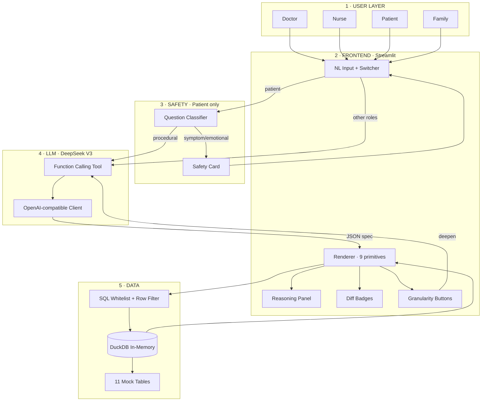

# Prisma · Architecture Summary / 架构概要

> Bilingual reference doc. Pairs with `ARCHITECTURE.md` (full version), `PLAN.md` (build plan), `ADDITIONS.md` (agentic enhancements), `slides.md` (deck).
> 双语参考文档。配合 `ARCHITECTURE.md`（完整版）、`PLAN.md`（实施计划）、`ADDITIONS.md`（agentic 加强）、`slides.md`（演示稿）使用。

---

## Overview / 总览

**EN** · Prisma is a multi-stakeholder generative dashboard for hospital post-op care. One underlying patient state ("the truth") is refracted into four role-specific UIs (doctor / nurse / patient / family) — each with different content, different language, and different boundaries. The architecture is **spec-first, not code-gen**: the LLM outputs structured JSON, a deterministic renderer turns it into Plotly charts, and a SQL guard enforces permissions at the data layer.

**CN** · Prisma 是面向医院术后照护的多角色生成式看板。一份底层的患者状态（"事实"）被折射成四个角色专属的 UI（医生 / 护士 / 患者 / 家属）——内容不同、语言不同、边界不同。架构核心是 **spec-first，不是 code-gen**：LLM 输出结构化 JSON，确定性渲染层把它翻译成 Plotly 图表，SQL guard 在数据层强制权限。

---

## Architecture Diagram / 架构图



---

## The Five Layers / 五个层次

### Layer 1 · User Layer / 用户层

**EN** · Four roles, four different access patterns. Doctor has full access plus granularity controls. Nurse sees only their own patients on their current shift. Patient sees their own data with safety classification on every NL input. Family sees a translated, summarized view of one patient.

**CN** · 四个角色，四种不同访问模式。医生拥有全量访问 + 颗粒度控制。护士只看自己负责的本班患者。患者只看自己数据，每次 NL 输入都过安全分类。家属看到的是某一个患者的翻译过、摘要过的视图。

### Layer 2 · Frontend · Streamlit / 前端层

**EN** · The user-facing shell. Six components: NL input, role/patient switcher, renderer (with 9 primitives, the medical-specific `vital_trajectory` being key), reasoning panel (visible AI thinking), diff badge system (visible regeneration), granularity controls (doctor only). Streamlit's `session_state` carries `current_spec` and `previous_spec` for diff computation.

**CN** · 用户面对的外壳。六个组件：NL 输入、角色/患者切换器、渲染器（9 个原语，医疗特化的 `vital_trajectory` 最关键）、reasoning panel（AI 思考可见）、diff badge 系统（重渲染可见）、颗粒度控制（仅医生）。Streamlit 的 `session_state` 维护 `current_spec` 和 `previous_spec` 用于 diff 计算。

### Layer 3 · Safety Layer (Patient Only) / 安全层（仅患者端）

**EN** · The most important architectural decision in the system. Every patient NL input goes through a lightweight classifier before reaching the main LLM pipeline. Outputs `procedural` (continue to main pipeline), `symptom` / `emotional` (route to a hardcoded safety card with a "call nurse" button — no LLM medical answers ever), or `chitchat` (short text reply). Designed conservative: if uncertain, default to `symptom`.

**CN** · 系统中最重要的架构决策。患者每次 NL 输入都先过一次轻量分类器，再决定是否进入主 LLM 管线。输出 `procedural`（进主管线）、`symptom` / `emotional`（走硬编码安全卡 + 呼叫护士按钮，**LLM 永不回答医疗问题**）或 `chitchat`（简短文本回应）。设计保守：不确定时默认归 `symptom`。

### Layer 4 · LLM Layer / LLM 层

**EN** · DeepSeek V3 via OpenAI-compatible SDK (one line `base_url` change away from Claude/GPT). Function calling enforces structured output — the tool schema requires `intent`, `reasoning`, `rejected_options`, `layout[]`, `granularity_options`, etc. Three prompt modes: generation (initial query), deepen (granularity button), drilldown (chart click). Retry once on JSON parse failure, fall back to cached spec on second failure.

**CN** · DeepSeek V3 通过 OpenAI 兼容 SDK 接入（`base_url` 改一行就能切到 Claude / GPT）。Function calling 强制结构化输出——tool schema 要求 `intent` / `reasoning` / `rejected_options` / `layout[]` / `granularity_options` 等字段。三种 prompt 模式：生成（首次提问）、加深（颗粒度按钮）、下钻（图表点击）。JSON 解析失败重试一次；二次失败降级到 cache。

### Layer 5 · Data Layer / 数据层

**EN** · The security core lives here, not in prompt. `safe_execute()` enforces three layers: (1) keyword blacklist (no INSERT/UPDATE/DELETE/DROP), (2) table whitelist (only the 11 mock tables), (3) **role-based row filter as hard constraint**, automatically injecting `WHERE patient_id = ?` for patient/family roles regardless of what the LLM produced. DuckDB in-memory holds 11 tables seeded by parameterized `seed.py` — Wang Wei generated with `profile=stable`, Li Xiuying with `profile=labile`.

**CN** · 安全核心在这一层，不在 prompt 里。`safe_execute()` 强制三层校验：（1）关键字黑名单（禁 INSERT / UPDATE / DELETE / DROP），（2）表名白名单（仅 11 张 mock 表），（3）**角色级 row filter 作为硬约束**——不管 LLM 输出什么，对患者/家属角色自动注入 `WHERE patient_id = ?`。DuckDB 内存库装载 11 张表，由参数化 `seed.py` 生成——王伟 `profile=stable`，李秀英 `profile=labile`。

---

## Three Critical Flows / 三个关键流程

### Flow A · Doctor Query / 医生查询

```
Doctor input → Prompt Builder → DeepSeek (function call) → spec
  → Renderer → SQL Guard → DuckDB → render charts
  → Reasoning Panel + Granularity Controls visible
```

**EN** · Standard generation path. Total latency ~2-4 seconds. No safety classifier (doctor role bypasses it). Spec is saved to `previous_spec` for the next round's diff computation.

**CN** · 标准生成路径。总延迟约 2-4 秒。不过安全分类器（医生角色直接绕过）。Spec 存入 `previous_spec` 供下一轮 diff 计算。

### Flow B · Patient Symptom Question / 患者 symptom 问题

```
Patient input ("Will my heart be okay?")
  → Question Classifier → "emotional"
  → Safety Card (hardcoded, no LLM call)
  → "Call Nurse" button rendered
```

**EN** · The pitch's safety anchor. Total latency ~1 second (only the classifier call). LLM main pipeline is short-circuited — never invoked. This is the system's hardest promise to hospital buyers.

**CN** · Pitch 的安全锚。总延迟约 1 秒（仅分类器调用）。LLM 主管线被 short-circuit——根本不调。这是系统对医院 buyer 最硬的承诺。

### Flow C · Granularity Deepen + Diff / 颗粒度加深 + Diff

```
Doctor clicks "Time resolution → 24h"
  → Prompt Builder (DEEPEN mode) with previous_spec attached
  → DeepSeek → new spec
  → compute_spec_diff(previous, new) → ✨ new / 🔄 modified / removed
  → Renderer with badges + top toast summary
```

**EN** · The agentic-UI proof. Each component carries a visible badge showing what changed. Top toast announces "Updated: X new, Y modified, Z removed". This is Cursor's accept-reject pattern transplanted to dashboards.

**CN** · Agentic UI 的证明。每个组件挂一个可见 badge 标识改动。顶部 toast 公告"本次更新：新增 X 个、修改 Y 个、删除 Z 个"。这是 Cursor 的 accept-reject 范式移植到 dashboard 上。

---

## Key Design Decisions / 关键设计决策

### Why spec-first, not code-gen / 为什么 spec-first 不 code-gen

**EN** · Code generation is slow, unstable, and a security risk (executing LLM-produced Python is an attack surface). Spec is structured data validated by tool schema; the renderer is fixed code. Faster, safer, auditable.

**CN** · 代码生成慢、不稳、有安全风险（执行 LLM 产出的 Python 是攻击面）。Spec 是结构化数据，由 tool schema 校验，渲染层是固定代码。更快、更稳、可审计。

### Why a separate classifier, not inline in main prompt / 为什么独立分类器不内嵌主 prompt

**EN** · Two reasons. First, the main prompt is already long; adding "judge if this is a medical question" splits the LLM's attention so both jobs degrade. Second, a separate classifier is cheap (short input, short output) and easy to fail-safe. Architecturally separating safety decisions from content generation is a hard requirement in medical contexts.

**CN** · 两个原因。一，主 prompt 已经很长，再叠"判断是不是医疗问题"会让 LLM 注意力分散，两件事都做不好。二，独立分类器调用便宜（短输入短输出），失败时容易降级。把"安全决策"和"内容生成"在架构上分离，是医疗场景的硬要求。

### Why SQL Guard, not ORM / 为什么 SQL Guard 而不是 ORM

**EN** · LLM-produced SQL is an attack surface, not developer-written SQL. ORMs assume the source is trusted; that assumption fails here. Direct keyword blacklist + WHERE injection on raw SQL is the more direct defense.

**CN** · LLM 输出的 SQL 是攻击面，不是开发者写的 SQL。ORM 假设 SQL 来源可信，这里假设不成立。直接对 raw SQL 做关键字黑名单 + WHERE 注入校验是更直接的防御。

### Why DeepSeek over Claude / GPT / 为什么用 DeepSeek 不用 Claude / GPT

**EN** · Strong on Chinese, OpenAI-compatible function calling (one-line `base_url` swap), low cost. Architecture is model-agnostic — switching providers is a one-line change.

**CN** · 中文场景强，OpenAI 兼容 function calling（一行 `base_url` 替换），成本低。架构与模型解耦——换厂商是一行代码的事。

---

## Architecture Diagram · Image Generation Prompt / 架构图 · 图像生成 Prompt

For deck use. 16:9 widescreen, slide-ready. Image gen tools garble fine text — keep labels short and overlay critical text in PowerPoint/Keynote afterward.
PPT 用，16:9 宽屏。图像生成工具对小字处理不稳，标签要短，关键文字事后用 PPT/Keynote 文本框盖一下。

```
A clean modern technical architecture diagram, 16:9 widescreen aspect 
ratio, isometric flat-design style inspired by Stripe and Linear 
documentation aesthetics. Pure white background with subtle drop shadows.

Five horizontal layers stacked vertically, each rendered as a tinted slab 
with rounded corners and a sans-serif label on the left edge.

LAYER 1 (top, light blue slab, label "USERS"): four small stylized character 
icons evenly spaced in a horizontal row — left to right: doctor in white 
coat with stethoscope, nurse in scrubs holding a tablet, patient lying on 
a hospital bed icon, family member silhouette holding a phone.

LAYER 2 (warm orange slab, label "FRONTEND"): a horizontal bar containing 
four chip-shaped modules left to right with short text inside each: 
"NL Input", "Renderer", "Reasoning", "Diff Badges". Small wordmark 
"Streamlit" on the left edge of the slab.

LAYER 3 (red slab, label "SAFETY"): a forking arrow diagram. The fork on 
the left ends in a red octagonal stop-sign icon adjacent to a bell icon 
labeled "Call Nurse". The fork on the right continues downward labeled 
"procedural".

LAYER 4 (deep purple slab, label "AI"): a hexagonal core in the center 
with text "DeepSeek V3" inside. A smaller chip-shaped module beside it 
with text "Function Call". Bidirectional arrows on both sides of the 
hexagon.

LAYER 5 (bottom, green slab, label "DATA"): a 3D cylinder icon with text 
"DuckDB", a small shield icon floating in front of it with text "SQL 
Guard", and a stack-of-papers icon to the right with text "11 Tables".

Soft cyan flowing arrows connecting the layers vertically with 
directional arrowheads. Subtle drop shadows, gentle ambient glow, 
professional vector illustration. All text is short (1-3 words) in clean 
sans-serif. No photorealistic elements, no clutter, no glow effects, no 
gradients. Composition centered and balanced, strict 16:9 widescreen 
ratio for slide presentation.
```

**Tip** · For best results: generate 4-6 variants, pick the one where the 5-layer stack reads cleanly even with text garbled. Then overlay accurate text labels in PowerPoint/Keynote text boxes. The visual structure is what's load-bearing; the text just needs to be roughly there.
**提示** · 跑 4-6 张变体，挑 5 层结构最清楚的那一张（文字哪怕糊也没关系）。然后在 PowerPoint / Keynote 里用文本框覆盖准确文字。视觉结构才是承重墙，文字大概对就够。
