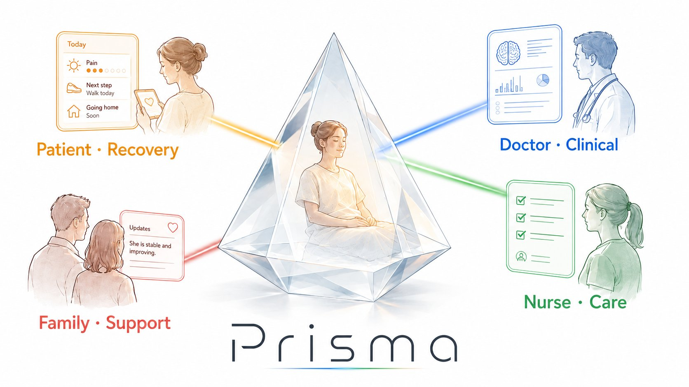

# Prisma — pitch deck

> **One truth. Four views. Made for this person, right now.**
>
> *This is the GitHub-readable version of the deck. The Slidev source for
> live presentation lives next door at [`slides.slidev.md`](slides.slidev.md)
> — run `npx slidev docs/slides.slidev.md` from the repo root to present.*

<div align="center">

</div>

<sub>Junyu Zhao (Andy) · Open to collab · zhaojyxs@gmail.com · 𝕏 [@realAndyZhao](https://x.com/realAndyZhao)</sub>

---

## 1 · Hospital information is broken — in four different ways

|  | Role | Pain |
|---|---|---|
| 🩺 | **Doctor** | **Drowning in data.** Two hours of paperwork for every one hour with patients. |
| 👩‍⚕️ | **Nurse** | **Lost at handoff.** 80 % of serious medical errors involve handoff communication *(Joint Commission)*. |
| ⭐ | **Patient** | **Information vacuum.** Five minutes a day with the doctor. Twenty-three hours alone with the anxiety. |
| 👨‍👩‍👧 | **Family** | **Phone tag.** Missed calls → worry → calls flood the nurse station. |

> Most medical AI helps the doctor. **Nobody is serving the other three.**

> *Speaker note · 45 seconds. Don't rush the patient quadrant — point at it.
> "Hospital information flow is broken — but not in one place. It's broken in
> four different ways for four different people. The one most products ignore
> is the middle: the patient sitting in an information vacuum. Today's medical
> AI mostly helps the doctor. Nobody's serving the other three."*

---

## 2 · This is a math problem

Static dashboards can't keep up:

```
stakeholder
× condition
× recovery stage
× current event
× user intent
─────────────────────────────
= tens of thousands of combinations
```

No team can hand-design that many dashboards. **This is math, not design.**

### Two real cases driving the demo

| 🏃 **Wang Wei** | 👵 **Li Xiuying** |
|---|---|
| 32, athlete | 71, DM2 + AF + prior MI |
| Tibial plateau, ORIF | Hip replacement |
| Discharges tomorrow | Recovery is rocky |

Same surgery. Same ward. Same day. **4 roles × 2 patients = 8 interfaces. None look alike.**

> *Speaker note · 45 seconds. Pause on "tens of thousands" — let it land.
> "Wang Wei and Li Xiuying are just two of those combinations. Same surgery,
> same ward, same day. But four roles times two patients gives you eight
> interfaces — and not one of them looks the same."*

---

## 3 · Live demo

Running on **DeepSeek V3 + Streamlit + DuckDB**.

### Demo script — 2 min 50 s total

| Time | What I do | What you should see |
|---|---|---|
| **0:00 – 0:20** | **Doctor view × Wang Wei.** Type *"How is Wang Wei doing in the last 24 hours?"* | The doctor's first dashboard. |
| **0:20 – 0:50** ⭐ | **Switch the patient dropdown to Li Xiuying.** | The whole dashboard regenerates. *Same doctor, different patient.* This is **Refraction**. Open *How the AI thought about this* and read one rejected option aloud. |
| **0:50 – 1:20** | Click **Adjust view → Last 24 hours**. | Watch the badges — *added* / *changed*. Every modification announces itself. Cursor's accept-reject pattern, applied to dashboards. |
| **1:20 – 1:50** ⭐⭐⭐ | **Switch to Li Xiuying × Patient view.** Type *"Will my heart be okay?"* **Wait one beat.** | The AI does **not** answer. It calls a nurse instead. We call this **Graceful Refusal** — refusal as a visible action in the UI, not a hidden rule in a system prompt. *This is the most important promise we make to hospitals.* |
| **1:50 – 2:20** | **Switch to Li Xiuying × Family view.** | Same underlying fact. Doctor sees numbers. Family sees *"Mom is stable today."* This isn't permission filtering — it's **Cognitive Recasting**. Same truth, translated for the reader. |
| **2:20 – 2:50** | Briefly back to a doctor view. Show the reasoning panel one more time. | Every dashboard has its own *why I built this* card. Auditable. Explainable. Editable. |

> **Three moments judges must remember**
>
> | 0:20 | patient switch       | → Refraction visible |
> | 1:20 | heart question       | → Graceful Refusal lands |
> | 1:50 | family view tone     | → Cognitive Recasting completes |

---

## 4 · Three patterns we are claiming as new

### 🔷 Pattern 1 — Refraction
**One truth → many UIs.**
The agent is a *prism*, not a renderer. It splits one underlying patient state
into role-specific views, in real time.

### 🔷 Pattern 2 — Cognitive recasting
**Same fact → different language.**
Doctors see numbers. Patients see plain words. Family sees reassurance.
Not permission filtering — semantic translation.

### 🔷 Pattern 3 — Graceful refusal
**"No" as a visible action.**
When the agent shouldn't act, refusal becomes a UI element — not a hidden rule
in a system prompt.

---

> Today's generative UI: Cursor, v0, Canvas — all *one user × one intent × one UI*.
>
> **Prisma:** *one truth × many stakeholders × many UIs.*

> *Speaker note · 45 seconds. Don't rush. These three words are what they
> remember. "And the more important shift is graceful refusal. Today's
> agentic UI is racing to do MORE. We're showing an agent that knows what
> it shouldn't do — and turns that refusal into a visible action in the
> interface, not a hidden rule in a system prompt."*

---

## 5 · Why now, and what's next

### Buyer
**Hospitals.** Orthopedic and trauma surgery wards, post-op care unit.

### Value
- ↓ Length of stay
- ↓ Doctor paperwork

> Every 0.5 day saved × thousand beds = real money.

### Stack
**DeepSeek V3 + Streamlit + DuckDB.** Three hours from zero to demo.

### What's next
**Cross-stakeholder consistency.** When the doctor updates a discharge plan,
the patient's countdown, the family's notification, and the nurse's task list
all update — automatically, in sync, across views.

---

> ## *The next chapter of agentic UI isn't smarter agents. It's more disciplined agents.*

---

## 6 · Open to collab

<div align="center">

</div>

If you're building **agentic interfaces**, **healthcare AI**, or **generative UI** — let's talk.

| | |
|---|---|
| **Name** | Junyu Zhao (Andy) |
| **Email** | [zhaojyxs@gmail.com](mailto:zhaojyxs@gmail.com) |
| **WhatsApp** | +60919592 |
| **𝕏** | [@realAndyZhao](https://x.com/realAndyZhao) |

> *One-line summary, if anyone asks:*
> **The agent is a prism, not a renderer — and it knows what it shouldn't refract.**
